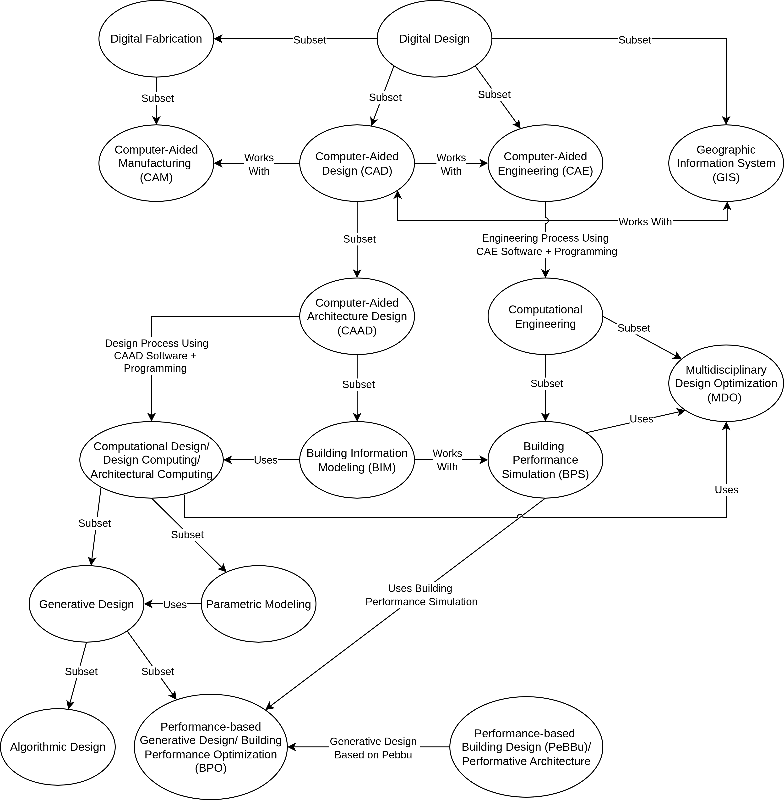

Title: The Many Terms of Using Computers in Architectural Design 
Description: Providing an overview of the research topics in the use of computers in architectural design
Date: 2026-06-05
Authors: Kian Wee Chen
Status: published
Duration: 10 mins
Category: Essay

I have came across many terms used for describing the use of computers in architecture design. The meaning of these terms are often ambiguous, overlaps and used inconsistently. In this essay, I attempt to list, sort and arranged the terms into a diagram to show their relationships. It is followed by a glossary providing a short explanation of each term. I hope to provide an overview and a starting point for new researchers to have a feel for the field. Based on your research interest choose a topic/direction, then with a topic in mind, refer to this post <a href="08_study_cdgn.html" target="_blank">Computational Design Research</a> to decide if the topic is a data strucures & algorithms, software development or application research. 

<a href="https://www.linkedin.com/posts/kian-wee-chen-79b2b721_some-of-my-thoughts-put-on-a-diagram-about-share-7468877718273728512-7SbE/?utm_source=share&utm_medium=member_desktop&rcm=ACoAAAR-VqcBI2WVhLSf-dcz1wsslwv9rVp1vYE" target="_blank">Hope this is helpful and we can continue the conversation in the comments</a>!

## Glossary
**Digital Design**: The use of digital data whether it is text, images, Geography Information System (GIS) data or Computer-Aided Design (CAD) data for design, from project planning to design & manufacturing, and even lifecycle management. (<a href="https://digitaldesign.aalto.fi/" target="_blank">Guide for Digital Design</a>)

**Geography Information System (GIS)**: GIS software enables the reading, writing and editing of geospatial data in relation to a reference coordinate system. The reference coordinate system allows users to pinpoint any location on Earth using 3 numbers longitude, latitude and elevation. (<a href="03_gis.html" target="_blank">Southeast Asia Building (SEAB) Magazine Inteview on the Use of GIS in Architectural Design</a>)

**Computer-Aided Design (CAD)**: CAD software aid in the creation, modification, analysis, or optimization of a design in forms of 2D drawings and 3D models. (<a href="https://en.wikipedia.org/wiki/Computer-aided_design" target="_blank">Wikipedia</a>)

**Computer Aided Architectural Design (CAAD)**: CAAD are a distinct class of CAD software developed for the use by architects and planers. (<a href="https://digitaldesign.aalto.fi/digital-design-workflows/caad/" target="_blank">Guide for Digital Design</a>)

**Building Information Modeling (BIM)**: An approach involving the generation and management of digital representations of the physical and functional characteristics of buildings or other physical assets and facilities. The models created from the process (Building Information Models) are computer files exchanged and shared among designers for making decision. Industry Foundation Class (IFC) is the most commonly used open standard for BIM. (<a href="https://en.wikipedia.org/wiki/Building_information_modeling" target="_blank">Wikipedia</a>)

**Computational Design**: The use of computer programming to solve engineering/architecture design problems. (<a href="08_study_cdgn.html" target="_blank">Computational Design Research</a>) Synonyms include <a href="https://www.taylorfrancis.com/books/mono/10.4324/9781315680057/design-computing-brian-johnson" target="_blank">**Design Computing**</a> and **Architectural Computing**.

**Parametric Modeling**: A design approach based on the use of parameters to describe sets of designs. (<a href="https://doi.org/10.1016/j.foar.2019.12.008
" target="_blank">Computational design in architecture: Defining parametric, generative, and algorithmic design</a>) 

**Generative Design**: A design approach that uses algorithms to generate designs. (<a href="https://doi.org/10.1016/j.foar.2019.12.008
" target="_blank">Computational design in architecture: Defining parametric, generative, and algorithmic design</a>)

**Algorithmic Design**: A Generative Design approach characterized by an identifiable correlation between the algorithm and its outcome. (<a href="https://doi.org/10.1016/j.foar.2019.12.008" target="_blank">Computational design in architecture: Defining parametric, generative, and algorithmic design</a>)

**Performance-based Generative Design**: A Generative Design approach where the designer sets a performance target, and an algorithm finds design solutions that best approximate the desired goal (<a href="https://doi.org/10.1016/j.foar.2019.12.008" target="_blank">Computational design in architecture: Defining parametric, generative, and algorithmic design</a>). Synonyms include <a href="https://www.cell.com/heliyon/fulltext/S2405-8440(25)00860-6" target="_blank">**Building Performance Optimization**</a>.

**Performance-based Building Design**: A building constructed in this way is required to meet certain measurable or predictable performance requirements, without a specific prescribed method by which to attain those performance. This is in contrast to traditional prescribed building codes, which mandate specific construction practices. (<a href="https://www.irbnet.de/daten/iconda/CIB9147.pdf" target="_blank">CIB Performance Based Building (PeBBu)
Thematic Network</a>) Synonyms include <a href="https://www.taylorfrancis.com/books/mono/10.4324/9780203017821/peformative-architecture-branko-kolarevic-ali-malkawi" target="_blank">**Performative Architecture**</a>. 

**Digital Fabrication**: Design and manufacturing workflow where CAD data is transferred to Computer-Aided Manufacturing (CAM) software that directs a specific manufacturing tool to produce the design physically. Digital manufacturing tool includes 3D printers, Computer Numerical Control (CNC) milling and robotic arms (<a href="https://formlabs.com/blog/digital-fabrication-101/" target="_blank">Formlabs Digital Fabrication 101</a>)

**Computational Engineering**: The art and science of developing and applying computational models, simulations, and advanced analytical techniques to understand, predict, and optimize complex engineered systems. The goal is to create in digital representations of real-world engineering problems, enabling detailed analysis and informed decision-making (<a href="https://www.clrn.org/what-is-computational-engineering/" target="_blank">California Learning Resource Network</a>). 

**Computer-Aided Engineering (CAE)**: The use of computer software to simulate, analysis and optimze engineering design (<a href="https://www.twi-global.com/technical-knowledge/faqs/what-is-computer-aided-engineering" target="_blank">The Welding Institute (TWI)</a>). 

**Building Performance Simulation**: Replication of aspects of building performance using a computer-based, mathematical model created on the basis of fundamental physical principles. Building performance simulation has various sub-domains. Most prominent are thermal simulation, lighting simulation, acoustical simulation and air flow simulation. It is a field within the wider realm of scientific computing (<a href="https://en.wikipedia.org/wiki/Building_performance_simulation" target="_blank">Wikipedia</a>).

**Multidisciplinary Design Optimization (MDO)**: Approach to formalize problem decomposition and coordination among groups working on the design of complex engineering systems that involves multiple engineering disciplines (<a href="https://mdolab.engin.umich.edu/" target="_blank">MDO Lab</a>, & <a href="https://www.itcon.org/paper/2009/38" target="_blank">Multidisciplinary process integration and design optimization of a classroom building</a>). 

# References
- Caetano, I., Santos, L., Leitão, A., (2020). Computational design in architecture: Defining parametric, generative, and algorithmic design. Frontiers of Architectural Research 9, 287–300.

- Yu, R., Gu, N., Ostwald, M.J., (2021). Computational Design: Technology, Cognition and Environments, 1st ed. CRC Press, Oxon, England.

- Johnson, B., (2016). Design Computing: An Overview of an Emergent Field, 1st ed. Routledge, New York, USA.

