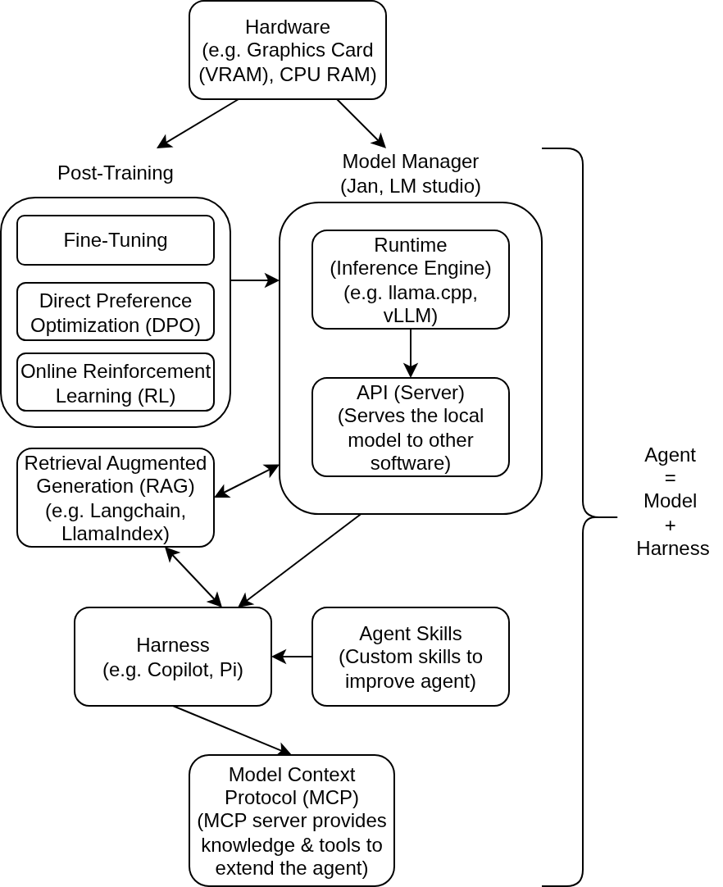

Title: Learning How to Deploy Local Large Language Model (LLM) 
Description: Overview of the concepts and software stack required to deploy local LLM
Date: 2026-07-05
Authors: Kian Wee Chen
Status: hidden
Duration: 10 mins
Category: Essay

I have been using the free-tier OpenAI and Gemini LLMs for supporting my programming activities. They have been very useful and significantly improve my productivity. However, I am not fond of the idea of being beholden to online LLMs API (e.g. openAI and Gemini) for supporting my programming activities. The support stops once I lose connection or they become unaffordable with charges as they remove the free tier models. I see potential in the use of local LLM model. I like the privacy and the control I have with local models. Thus I set out to understand the hardware and software stack required for running local LLMs. I also look at the various terms that are commonly thrown around when discussing LLMs e.g. post-training, fine-tuning, harness etc ... In this article, I sort out what I have learned and provide an overview on the subject. 

The diagram below provides an overview of the hardware and software you will require to deploy LLM locally on your laptop. You will need a sufficiently powerful laptop, at least a workstation grade laptop with dedicated graphics card. I was able to run Gemma 4-E2B comfortably, Gemma 4-E4B at a much slower speed and barely run Gemma 4-12B on my Dell Precision 3490 workstation (14 core CPUs, 16 GB RAM, NVIDIA RTX 500 Ada Generation Laptop GPU, 4GB vRAM). On the software side, you will need a model manager (e.g. Jan, LM Studio & Ollama) to run your LLM. A model manager usually includes runtime or inference engine (e.g. llamma.cpp, vLLM) and a server to server your LLM to other software and services. You will then configure your harness (e.g. copilot, Pi) to talk to your LLM using the model server API (e.g. OpenAI API).  <a href="https://code.visualstudio.com/blogs/2026/05/15/agent-harnesses-github-copilot-vscode" target="_blank">An agent is essentially your LLM + Harness</a>. For the case of the copilot agent, the harness communicates to the LLM deploy on your laptop to write programming codes. I have written a <a href="https://code.visualstudio.com/blogs/2026/05/15/agent-harnesses-github-copilot-vscode" target="_blank">tutorial on how to deploy LLM locally using Jan ai with the vscode copilot extension for use as a coding support</a>.

