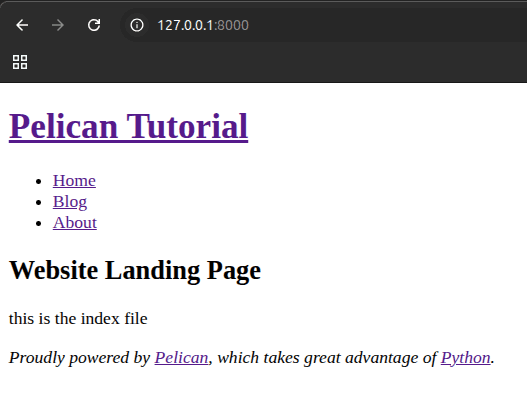

Title: 01. Minimal Site with Landing, Blog Index and About Pages
Subtitle: Pelican Tutorial
Status: draft
Page_type: side_navbar

This tutorial is best read together with my [Pelican blog post](../blogs/09_pelican.html) on the underlying workings of Pelican and why I use Pelican for my website. In this tutorial I am using an Ubuntu machine. As Pelican is Python-based, the commands are OS agnostic and should work on other OS. I assumed you are familiar with Python, knows how to create a virtual environment, and pip install Pelican. 

We are trying to create a website with a landing page, blog index page and an about page using the Pelican 'simple' theme. 

# Step-by-Step
1.  Generate a Pelican project with the following command.

        pelican-quickstart
    
2.  It will ask you a bunch of questions. Here are my answers. In this tutorial we will be uploading our website to github pages.

        Where do you want to create your new web site? [.]
        What will be the title of this web site? Pelican Tutorial
        Who will be the author of this web site? [Your Name]
        What will be the default language of this web site? [en]
        Do you want to specify a URL prefix? e.g., https://example.com   (Y/n) n
        Do you want to enable article pagination? (Y/n) y
        How many articles per page do you want? [10]
        What is your time zone? [Europe/Rome] America/New_York
        Do you want to generate a tasks.py/Makefile to automate generation and publishing? (Y/n) y
        Do you want to upload your website using FTP? (y/N) n
        Do you want to upload your website using SSH? (y/N) n
        Do you want to upload your website using Dropbox? (y/N) n
        Do you want to upload your website using S3? (y/N) n
        Do you want to upload your website using Rackspace Cloud Files? (y/N) n
        Do you want to upload your website using GitHub Pages? (y/N) y
        Is this your personal page (username.github.io)? (y/N) n 

3.  Once you answered these questions, a project folder will be generated in the current folder. The folder structure will be as follows:

        content
        output
        Makefile
        pelicanconf.py
        publishconf.py
        tasks.py

4. Create 'blogs' and 'pages' folder in the 'content' folder. In each folder creates markdown files as shown below.

        content
        |----- blogs
             |----- article1.md
             |----- article2.md
        |----- pages
             |----- index.md
             |----- about.md
        output
        Makefile
        pelicanconf.py
        publishconf.py
        tasks.py

5. Put the following content in each of the markdown file.

        ----------------------------------------------------------
        article1.md
        ----------------------------------------------------------
        Title: My First Review
        Date: 2010-12-03 10:20
        Category: Review

        Following is a review of my favorite mechanical keyboard.
        ----------------------------------------------------------
        article2.md
        ----------------------------------------------------------
        Title: My second Review
        Date: 2010-12-03 10:20
        Category: Review

        Following is a review of my favorite mechanical keyboard.
        ----------------------------------------------------------
        index.md
        ----------------------------------------------------------
        Title: Website Landing Page
        Save_as: index.html
        Status: hidden

        this is the index file
        ----------------------------------------------------------
        about.md
        ----------------------------------------------------------
        Title: About
        Status: hidden

        this is the about file

6.  Copy and paste the following onto your 'pelicanconf.py' file.

        AUTHOR = '[Your Name]'
        SITENAME = 'Pelican Tutorial'
        SITEURL = ""

        PATH = "content"

        THEME = 'simple' # default was 'notmyidea'

        TIMEZONE = 'America/New_York'

        DEFAULT_LANG = 'en'

        # Feed generation is usually not desired when developing
        FEED_ALL_ATOM = None
        CATEGORY_FEED_ATOM = None
        TRANSLATION_FEED_ATOM = None
        AUTHOR_FEED_ATOM = None
        AUTHOR_FEED_RSS = None

        # Blogroll
        LINKS = (
        ("Pelican", "https://getpelican.com/"),
        ("Python.org", "https://www.python.org/"),
        ("Jinja2", "https://palletsprojects.com/p/jinja/"),
        ("You can modify those links in your config file", "#"),
        )

        # Social widget
        SOCIAL = (
        ("You can add links in your config file", "#"),
        ("Another social link", "#"),
        )

        DEFAULT_PAGINATION = 10

        # Uncomment following line if you want document-relative URLs when developing
        # RELATIVE_URLS = True

        # Uncomment following line if you want document-relative URLs when developing
        # RELATIVE_URLS = True
        LOAD_CONTENT_CACHE = False  # default was True
        DELETE_OUTPUT_DIRECTORY = True  # default was False
        USE_FOLDER_AS_CATEGORY = False  # default was True
        SLUGIFY_SOURCE = 'basename'  # default was 'title'

        INDEX_SAVE_AS = '/blogs/index.html'  # default was 'index.html'
        ARTICLE_PATHS = ['blogs']  # default was ['']
        PAGE_PATHS = ['pages']  # default was ['pages']

        PATH_METADATA = r'(?P<path_no_ext>.*)\..*'  # default was ''
        ARTICLE_URL = '{path_no_ext}.html'  # default was '{slug}.html'
        PAGE_URL = '{path_no_ext}.html'  # default was 'pages/{slug}.html'

        ARTICLE_SAVE_AS = '{path_no_ext}.html'  # default was '{slug}.html'
        PAGE_SAVE_AS = '{path_no_ext}.html'  # default was 'pages/{slug}.html'

        ARCHIVE_SAVE_AS = False
        DISPLAY_CATEGORIES_ON_MENU = False
        CATEGORIES_SAVE_AS = 'categories.html'

        STATIC_PATHS = ['images']

        MENUITEMS = (
        ("Home", f"{SITEURL}/"),
        ("Blog", f"{SITEURL}/blogs/"),
        ("About", f"{SITEURL}/pages/about.html"),
        )

7. Go to the folder where you store your Pelican tutorial website folder and run the following command to serve the website locally in your computer.

        pelican -rl

8. In your browser go to 'localhost:8000'. You should see the following webpage.

    

9. Congrats! You have created a webpage with a landing page, blog index page and an about page. Next we will have to work on the theme to make the webpage look better.