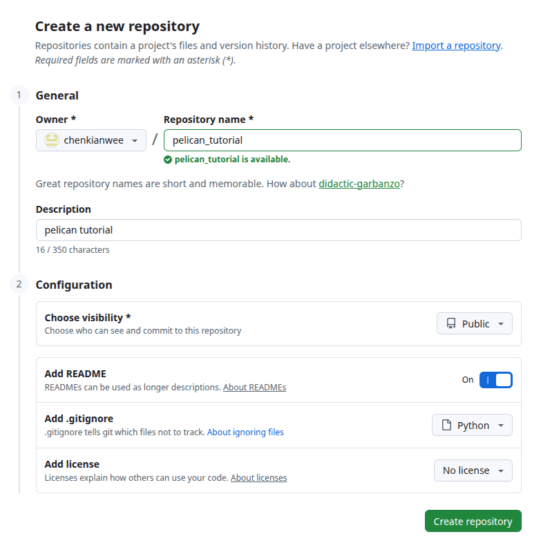
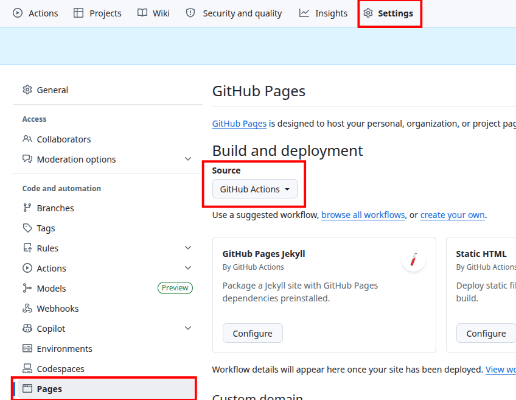
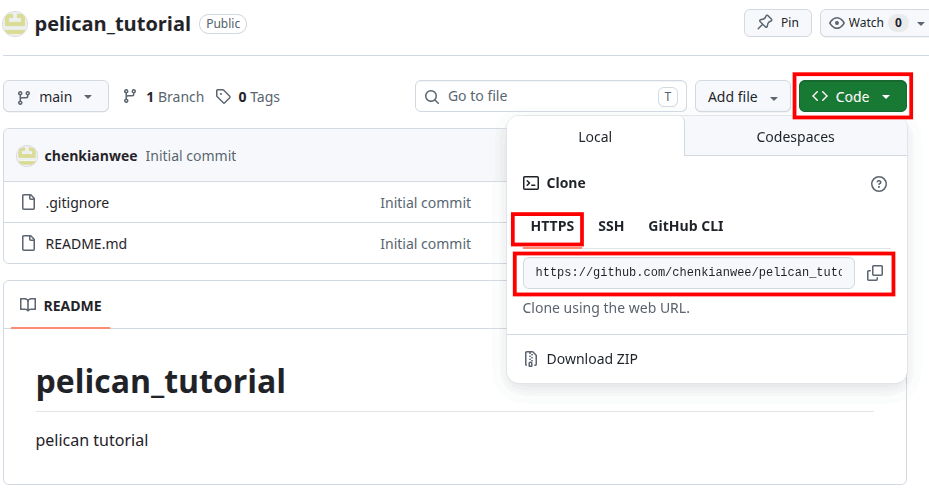
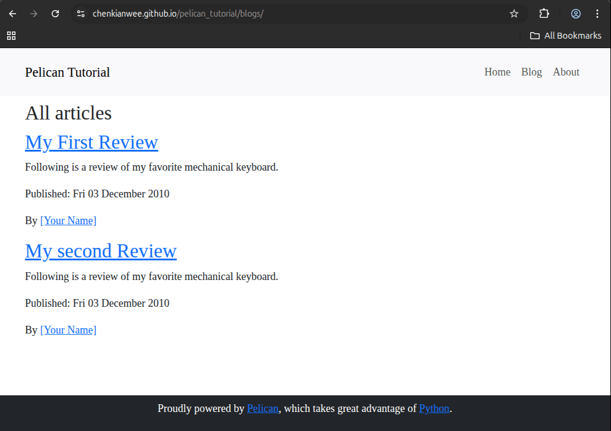
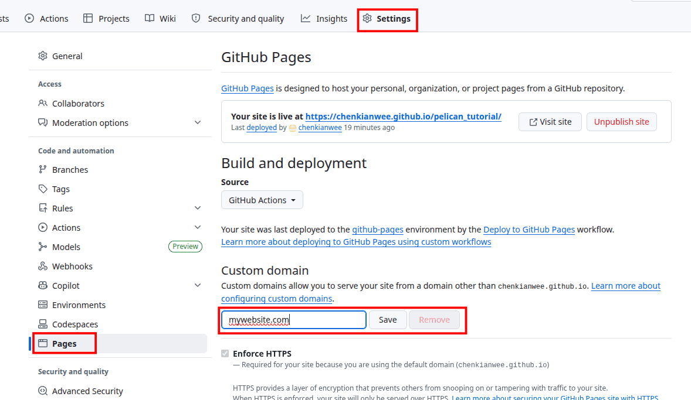

Title: Hosting your Website on Github Pages
Subtitle: Pelican Tutorial
Status: hidden
Page_type: side_navbar

Our tutorial website is looking good so far. Now we want to share it with everyone online. Github has a free function called pages that host static webpages as long as you keep the repository public. The URL where your webpage will be served is *your_username.github.io/repository_name*. For this tutorial, I am going to name it chenkianwee.github.io/pelican_tutorial.

# Step-by-Step
1. Register a github account if you have not. Add a new repository called pelican_tutorial.

    

2. Go to the repository Settings -> Pages -> Source and change it to Github Actions

    

3. Download and install git on your computer <a href = "https://git-scm.com/install/" target = "_blank">here</a>. Clone the repository into your computer with the following git command. You can obtain your repository url on your repository by going to <> Code -> HTTPS -> repo_url following the image below.

                git clone <repository_url>
        
    

4. Once the repository is cloned. Copy and paste all your files from your previous tutorials into the cloned folder.

5. Create a .github folder (folder and files starting with a . means they are hidden, so you will need to enable show hidden files/folders to see them in your file explorer). In the .github folder create another folder called 'workflows' In the workflows folder create a file called 'pelican.yml'. Paste the following into the file.

        name: Deploy to GitHub Pages
        on:
            push:
                branches: ["main"]
            workflow_dispatch:
        jobs:
            deploy:
                uses: "getpelican/pelican/.github/workflows/github_pages.yml@main"
            permissions:
                contents: "read"
                pages: "write"
                id-token: "write"
            with:
                settings: "publishconf.py"
                requirements: "pelican[markdown]"

6. Before committing to github and publish your website. Change your pelicanconf.py file SITEURL setting to the github url you will be publishing to. It should be like the following: change the 'username' field to your actual github username and repository name to the name of your repository.
 
        SITEURL = "https://<username>.github.io/<repository_name>" 

7. Once done cd to your folder, then stage, commit and push the files to the github repository.

        cd <your_pelican_tutorial_folder>
        git add .
        git commit -m "init commit"
        git push -u origin main

8. Congrats you have published your website online at github pages. Commit the changes and update your website.

    

## Using Custom Domain Name
Refer to github pages <a href = "https://docs.github.com/en/pages/configuring-a-custom-domain-for-your-github-pages-site/about-custom-domains-and-github-pages" target = "_blank">documentation</a> for the latest updates. 

1. Buy a domain name from websites like <a href = "https://www.namecheap.com/" target = "_blank">namecheap</a> and <a href = "https://www.dreamhost.com/domains/" target = "_blank">DreamHost</a>.

2. On the github pages setting page specify your domain name.

    

3. Go to where you buy your domain name. Setup your DNS as follows.

        Type            Host    Value                   TTL
        A Record        @       185.199.108.153         Automatic
        A Record        @       185.199.109.153         Automatic
        A Record        @       185.199.110.153         Automatic
        A Record        @       185.199.111.153         Automatic
        CNAME Record    www     <username>.github.io    Automatic

4. Follow this <a href = "https://docs.github.com/en/pages/configuring-a-custom-domain-for-your-github-pages-site/verifying-your-custom-domain-for-github-pages" target = "_blank">instructions</a> to verify your domain with github.

5. On Pelican configuration, follow these <a href = "https://docs.getpelican.com/en/latest/tips.html#copy-static-files-to-the-root-of-your-site" target = "_blank">instructions</a> for the latest updates. First create a folder called 'extra' in your 'content' folder. Create a file named 'CNAME'. Inside the file on the first line just put your domain name

        mysite.com  

6. In your pelicanconf.py add these two variables.

        STATIC_PATHS = ['images', 'extra/CNAME']
        EXTRA_PATH_METADATA = {'extra/CNAME': {'path': 'CNAME'},}

7. In your publishconf.py file update the SITEURL to your custom domain. Make sure your SITEURL in publishconf.py matches the domain in your CNAME file

8. Publish your website to the pages and you can visit your website with your custom domain name.

9. For the next tutorial I will look at the use of plugins and external tools with Pelican.